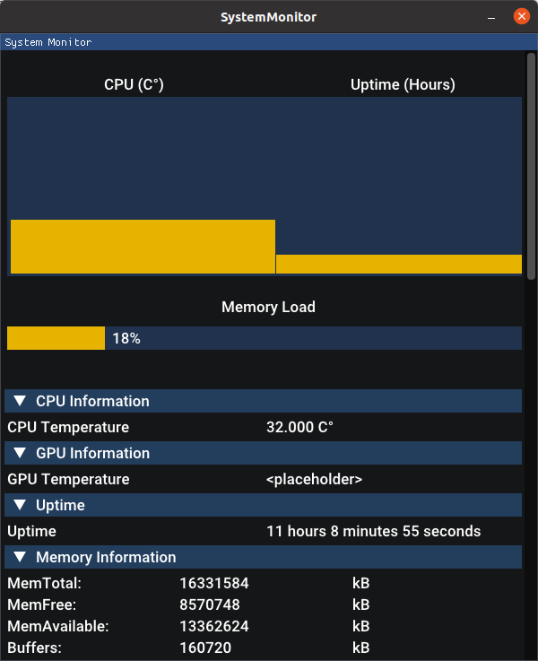

# SystemMonitor  

[](https://dev.azure.com/huttongrabiel/SystemMonitor/_build/latest?definitionId=1&branchName=main)

Simple C++ GUI Application for System Monitoring, Currently Supports:
  - CPU Temperature
  - Memory Information
  - Uptime  

 

# GUI Library Used
[Dear Imgui](https://github.com/ocornut/imgui)

# Building
Currently will only work on Linux systems. This is because the information is obtained from the
/proc files which is where the Linux kernel puts system information. Other OSes have some other variation of this and
eventually we will support other OSes. My best guess is that Mac wil be coming next, but first we have to make Linux nice.

**Linux**:  

In the project directory  
```
Build/build-linux.sh 
```

# Investigation In Reading CPU Temps for AMD
[CoreTemp.com](https://www.alcpu.com/CoreTemp/howitworks.html)  
[OverclockThread](https://www.overclock.net/threads/amd-temp-information-and-guide.1128821/)  
[OpenHardwareMonitor](https://openhardwaremonitor.org/) 

This one could be important, particularly *SB-TSI Protocol*   
[AMDOpenSourceRegisterReference](https://developer.amd.com/wp-content/resources/56255_3_03.PDF) 

**How CPU Temps are read in AMD chips**  
According to CoreTemp, "AMD processors report the temperature via a special  
register in the CPU's northbridge. Core Temp reads the value from the register  
and uses a formula provided by AMD to calculate the current temperature.The formula  
for the Athlon 64 series, early Opterons and Semprons (K8 architecture) is: **'Core Temp = Value - 49'**.  
For the newer generation of AMD processors like Phenom, Phenom II, newer Athlons,  
Semprons and Opterons (K10 architecture and up), and their derivatives, there is a different formula: **'CPU Temp* = Value / 8'**.  

*CPU Temp is because the Phenom\Opteron (K10) have only one sensor per package, meaning there is only one reading per processor.
